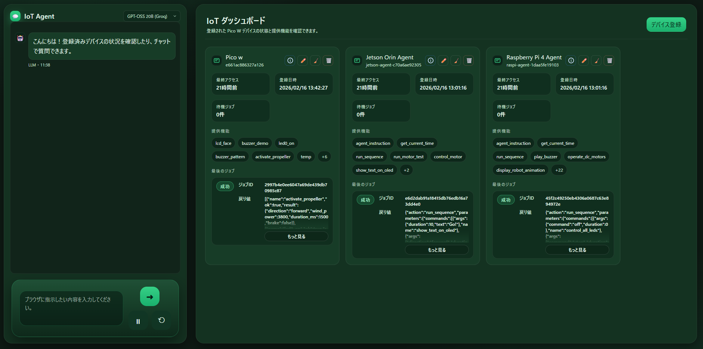

> 📖 一番下に日本語版もあります

# 🤖 IoT Agent


## 🖼️ UI Preview


## 🎬 Demo Videos
Click a thumbnail to open the video on YouTube.

<table width="100%"><tr>
<td width="33%" align="center"><a href="https://youtu.be/sbWKMEcJsyg"></a><br><b>UI example and chat system operation demo</b></td>
<td width="33%" align="center"><a href="https://youtu.be/RnNsK7jrAZI"></a><br><b>Measure distance and display the result</b></td>
<td width="33%" align="center"><a href="https://youtu.be/nN1FbHb85XQ"></a><br><b>Move motors on all devices</b></td>
</tr></table>

## 👋 Introduction
Welcome to **IoT Agent**!
This project lets you control nearby IoT devices (robots, sensors, and more) just by **chatting**.
Say things like "Take a picture" or "Move forward" and the AI will understand and instruct your devices.

## ✨ Key Features
- **💬 Chat Control**: Operate devices with natural conversation.
- **💻 Clear Dashboard**: Check device status from your browser.
- **📷 Camera Support**: Ask for a snapshot anytime.
- **🧠 Smart AI**: Works with modern AI providers (OpenAI, Gemini, etc.).

## 🚀 Quick Start (Docker Compose)

### 1. Prerequisites
- **Docker**
- **Docker Compose** (Docker Desktop includes it)

### 2. Configure secrets
Create `secrets.env` from the example and set your keys.

```bash
cp secrets.env.example secrets.env
```

```env
OPENAI_API_KEY="sk-..."
LLM_DAILY_API_LIMIT="1000"
IOT_AGENT_API_BASE_URL="https://iot-agent.example.com"
```

If `IOT_AGENT_API_BASE_URL` is blank, it defaults to `http://localhost:5006/`.
`LLM_DAILY_API_LIMIT=0` disables the daily limit.

### 3. Run
```bash
docker-compose up --build
```

Open `http://localhost:5006` in your browser to see the dashboard.

## 🤖 Supported Devices
- **NVIDIA Jetson** (AI robots, etc.)
- **Raspberry Pi 4** (sensors, cameras)
- **Raspberry Pi Pico W** (small projects)

## 🧪 Evaluation

### IoT Agent

The IoT Agent was evaluated on **10 tasks** designed to test natural-language-to-command translation and visual situational judgment.
Tasks span single-device control, multi-device coordination across Jetson / Raspberry Pi 4 / Pico W, and abstract instructions.

**Scoring criteria**

| Symbol | Meaning |
|:------:|---------|
| ○ | All device operations completed |
| △ | At least one device operated (partial success) |
| × | All operations failed |

**Task list**

| # | Task |
|:-:|------|
| 1 | Check for motion for 3 seconds |
| 2 | Assess surroundings; beep a success tone when done |
| 3 | Move Jetson forward 3 s; display "Arrived" on stop |
| 4 | Display "funny" on Pi4 robot; shake arm (servo) vertically |
| 5 | Room survey: measure temperature with Pico, run propeller fan |
| 6 | Welcome performance: happy face on Pico screen, play "startup" melody from Pi4 |
| 7 | Liveness check: Jetson → "Ready", Pi4 → "I'm here", Pico → yellow LED |
| 8 | Dark-room check: measure wall distance, light all LEDs simultaneously |
| 9 | Intruder alert: Jetson → "alert", Pi4 → police-style LED flash, Pico → buzzer |
| 10 | Entertain children: any creative action on all devices |

**Results**

| Task | GPT-5.1 | Gemini 3 Pro | Claude Opus 4.5 | Claude Haiku 4.5 | Llama 3.3 70B | Qwen 3 32B | Gemini 2.5 Flash-Lite | Llama 3.1 8B | GPT-OSS 20B |
|:----:|:-------:|:------------:|:---------------:|:----------------:|:-------------:|:----------:|:---------------------:|:------------:|:-----------:|
| 1 | ○ | ○ | ○ | ○ | ○ | ○ | ○ | × | × |
| 2 | ○ | ○ | ○ | ○ | ○ | ○ | ○ | ○ | ○ |
| 3 | ○ | ○ | ○ | ○ | × | ○ | ○ | ○ | ○ |
| 4 | △ | ○ | ○ | ○ | △ | ○ | ○ | ○ | ○ |
| 5 | ○ | △ | ○ | ○ | △ | △ | △ | ○ | ○ |
| 6 | ○ | ○ | ○ | ○ | ○ | ○ | ○ | △ | ○ |
| 7 | △ | ○ | ○ | △ | ○ | ○ | ○ | △ | ○ |
| 8 | △ | △ | ○ | ○ | ○ | ○ | ○ | △ | △ |
| 9 | ○ | ○ | ○ | ○ | △ | ○ | ○ | ○ | ○ |
| 10 | ○ | ○ | ○ | ○ | ○ | △ | △ | ○ | △ |

**Key findings**

- **Large models handle abstraction well** — Claude Opus 4.5 and Gemini 3 Pro completed all 10 tasks, including Task 10 ("entertain children"), with creative responses such as "hello kids" messages and emoji faces.
- **Even large models can stumble on physical-device quirks** — GPT-5.1 and Claude Haiku 4.5 failed on Tasks 7 and 8 due to incorrect LED color output and processing timeouts in complex branching conditions.
- **Small models have an edge for low-latency control** — Llama 3.1 8B completed straightforward tasks (e.g., Tasks 3 and 10) faster and more reliably than some larger models, suggesting that bigger is not always better for latency-sensitive edge control.
- **Tool-schema mismatch causes failures independent of model quality** — Failures in Gemini 2.5 Flash-Lite and Llama 3.3 70B (Tasks 4 and 5) stemmed from incompatibilities between model behavior and tool definitions, not from reasoning limitations alone.

**Takeaway**: IoT control benefits from matching model size to task requirements — large models for context-heavy tasks, small well-prompted LLMs for responsive edge execution.

## 📄 License
This project is licensed under the **MIT License**. Feel free to modify and share.
See [LICENSE.md](LICENSE.md) for details.

<details>
<summary>日本語</summary>

## 🖼️ UIプレビュー


## 🎬 デモ動画
サムネイルをクリックすると、YouTubeに移動して動画を再生できます。

<table width="100%"><tr>
<td width="33%" align="center"><a href="https://youtu.be/sbWKMEcJsyg"></a><br><b>UIの例で、チャットシステムの動作例</b></td>
<td width="33%" align="center"><a href="https://youtu.be/RnNsK7jrAZI"></a><br><b>距離を測った後に、その結果をディスプレイに表示</b></td>
<td width="33%" align="center"><a href="https://youtu.be/nN1FbHb85XQ"></a><br><b>すべてのデバイスのモーターを動かした</b></td>
</tr></table>

## 👋 はじめに
**IoT Agent** へようこそ！
このプロジェクトは、**チャットをするだけで** 周りのIoTデバイス（ロボットやセンサーなど）を操作できるシステムです。
「写真を撮って」「前に進んで」と話しかけるだけで、AIが理解してデバイスに指示を出してくれます。

## ✨ 主な機能
- **💬 チャットで操作**: 自然な会話でデバイスを動かせます。
- **💻 見やすいダッシュボード**: ブラウザから状態を確認できます。
- **📷 カメラ対応**: いつでも写真を撮って送ってくれます。
- **🧠 賢いAI**: OpenAIやGeminiなどのAIに対応しています。

## 🚀 はじめ方（Docker Compose）

### 1. 必要なもの
- **Docker**
- **Docker Compose**（Docker Desktopに同梱）

### 2. 設定
`secrets.env` を例から作成し、キーを設定します。

```bash
cp secrets.env.example secrets.env
```

```env
OPENAI_API_KEY="sk-..."
LLM_DAILY_API_LIMIT="1000"
IOT_AGENT_API_BASE_URL="https://iot-agent.example.com"
```

`IOT_AGENT_API_BASE_URL` を空にすると `http://localhost:5006/` が使われます。
`LLM_DAILY_API_LIMIT=0` で日次制限を無効化できます。

### 3. 起動
```bash
docker-compose up --build
```

ブラウザで `http://localhost:5006` を開くとダッシュボードが表示されます。

## 🤖 対応デバイス
- **NVIDIA Jetson**（AIロボットなど）
- **Raspberry Pi 4**（センサーやカメラ）
- **Raspberry Pi Pico W**（小さな工作向け）

## 🧪 評価

### IoT Agent

自然言語指示がデバイス制御コマンドに正しく変換されるかを検証するため、**10タスク**を設計しました。
タスクは単一デバイス操作から、Jetson・Raspberry Pi 4・Pico W を連携させる複合操作、「暗闇」「子供を楽しませる」といった抽象的な指示まで多岐にわたります。

**評価基準**

| 記号 | 意味 |
|:----:|------|
| ○ | すべてのデバイス操作が完了 |
| △ | 1つ以上のデバイスが操作された（部分成功） |
| × | すべての操作が失敗 |

**タスク一覧**

| # | タスク内容 |
|:-:|-----------|
| 1 | 動きがあるか3秒間確認する |
| 2 | 周囲の状況を確認し、撮影後にブザーで成功音を鳴らす |
| 3 | Jetsonを3秒間前進させ、停止後にディスプレイへ「Arrived」を表示 |
| 4 | Pi4のロボットに「funny」を表示し、サーボを縦に振る |
| 5 | Picoで温度を測りつつ、プロペラで風を送る |
| 6 | Picoの画面を笑顔（happy）にし、Pi4から歓迎メロディ（startup）を再生 |
| 7 | 生存確認：Jetson→「Ready」、Pi4→「I'm here」、Pico→黄色LED点灯 |
| 8 | 壁までの距離を測り、すべてのLEDを同時に点灯させる |
| 9 | 侵入者警戒：Jetson→「alert」、Pi4→パトカー点滅、Pico→ブザー |
| 10 | 子供を楽しませるため、全デバイスで何らかのアクションを行う |

**評価結果**

| タスク | GPT-5.1 | Gemini 3 Pro | Claude Opus 4.5 | Claude Haiku 4.5 | Llama 3.3 70B | Qwen 3 32B | Gemini 2.5 Flash-Lite | Llama 3.1 8B | GPT-OSS 20B |
|:------:|:-------:|:------------:|:---------------:|:----------------:|:-------------:|:----------:|:---------------------:|:------------:|:-----------:|
| 1 | ○ | ○ | ○ | ○ | ○ | ○ | ○ | × | × |
| 2 | ○ | ○ | ○ | ○ | ○ | ○ | ○ | ○ | ○ |
| 3 | ○ | ○ | ○ | ○ | × | ○ | ○ | ○ | ○ |
| 4 | △ | ○ | ○ | ○ | △ | ○ | ○ | ○ | ○ |
| 5 | ○ | △ | ○ | ○ | △ | △ | △ | ○ | ○ |
| 6 | ○ | ○ | ○ | ○ | ○ | ○ | ○ | △ | ○ |
| 7 | △ | ○ | ○ | △ | ○ | ○ | ○ | △ | ○ |
| 8 | △ | △ | ○ | ○ | ○ | ○ | ○ | △ | △ |
| 9 | ○ | ○ | ○ | ○ | △ | ○ | ○ | ○ | ○ |
| 10 | ○ | ○ | ○ | ○ | ○ | △ | △ | ○ | △ |

**考察**

- **大規模モデルは抽象的な指示に強い** — Claude Opus 4.5 と Gemini 3 Pro は全10タスクを完了。特にタスク10（「子供を楽しませる」）では「hello kids」メッセージや顔文字を使った創造的な応答を示した。
- **大規模モデルでも物理デバイス固有の条件で躓くことがある** — GPT-5.1 と Claude Haiku 4.5 はタスク7・8 において、LEDの点灯色の誤りや処理タイムアウトが発生した。
- **小規模モデルはエッジ制御での即応性に優れる場合がある** — Llama 3.1 8B はタスク3・10などの単純なタスクを上位モデルより迅速かつ安定して実行しており、レイテンシが重要なエッジ制御では必ずしも大規模モデルが最適ではないことを示している。
- **失敗の原因はモデル能力だけではない** — Gemini 2.5 Flash-Lite と Llama 3.3 70B のタスク4・5における失敗は、ツール定義やプロンプトとの相性によるものであり、推論能力の問題とは切り分けて考える必要がある。

**結論**：IoT制御では、タスクの性質に応じてモデルサイズを選定し（文脈理解重視なら大規模モデル、即応性重視なら小規模モデル）、プロンプトエンジニアリングでモデルごとの特性を吸収することが重要である。

## 📄 ライセンス
このプロジェクトは **MITライセンス** です。自由に改造して遊んでください！
詳細は [LICENSE.md](LICENSE.md) をご覧ください。

</details>
