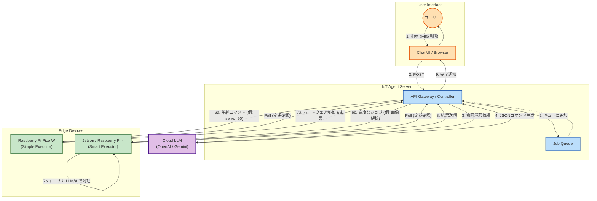

```mermaid
graph TD
    %% スタイル定義
    classDef user fill:#ffe0b2,stroke:#e65100,stroke-width:2px;
    classDef server fill:#bbdefb,stroke:#0d47a1,stroke-width:2px;
    classDef cloud fill:#e1bee7,stroke:#4a148c,stroke-width:2px;
    classDef edge fill:#c8e6c9,stroke:#1b5e20,stroke-width:2px;

    %% ユーザー層
    subgraph UserLayer [User Interface]
        User(("ユーザー")):::user
        UI["Chat UI / Browser"]:::user
    end

    %% サーバー層 (中央制御)
    subgraph ServerLayer [IoT Agent Server]
        API["API Gateway / Controller"]:::server
        Queue["Job Queue"]:::server
    end

    %% クラウドインテリジェンス
    CloudAI["Cloud LLM<br>(OpenAI / Gemini)"]:::cloud

    %% エッジデバイス層 (物理世界)
    subgraph EdgeLayer [Edge Devices]
        direction TB
        Pico["Raspberry Pi Pico W<br>(Simple Executor)"]:::edge
        SmartEdge["Jetson / Raspberry Pi 4<br>(Smart Executor)"]:::edge
    end

    %% フロー: 指示から実行まで
    User -->|"1. 指示 (自然言語)"| UI
    UI -->|"2. POST"| API
    
    %% サーバー処理
    API -->|"3. 意図解釈依頼"| CloudAI
    CloudAI -->|"4. JSONコマンド生成"| API
    API -->|"5. キューに追加"| Queue

    %% デバイス別処理フロー
    
    %% Pico: 単純なリモート制御
    Queue -.-> API
    Pico --"Poll (定期確認)"--> API
    API --"6a. 単純コマンド (例: servo=90)"--> Pico
    Pico --"7a. ハードウェア制御 & 結果"--> API

    %% Smart Edge: 自律的/高度な処理
    SmartEdge --"Poll (定期確認)"--> API
    API --"6b. 高度なジョブ (例: 画像解析)"--> SmartEdge
    SmartEdge --"7b. ローカルLLM/AIで処理"--> SmartEdge
    SmartEdge --"8. 結果送信"--> API

    %% 結果のフィードバック
    API -->|"9. 完了通知"| UI
    UI --> User
```